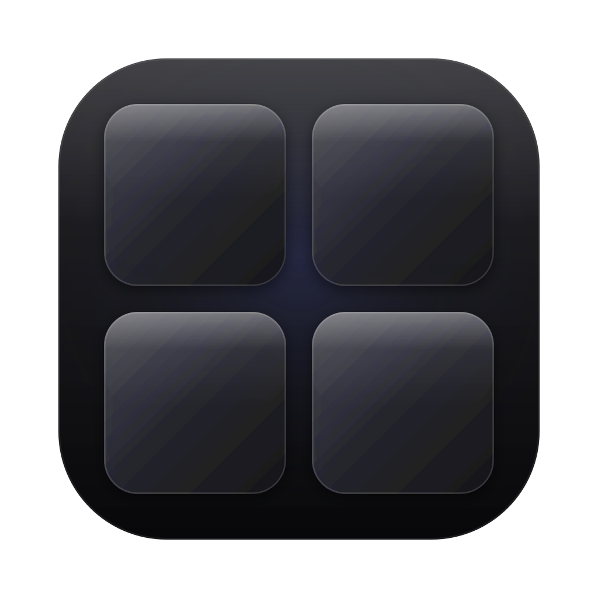
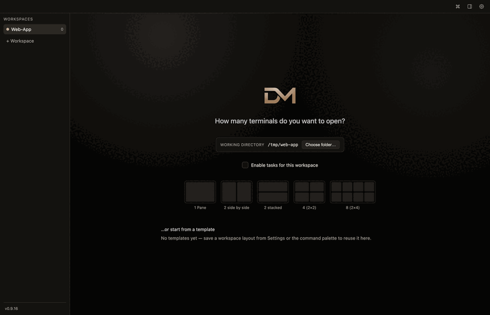

  

<h1 align="center">DM Workspace</h1>

  A cross-platform tiling terminal app that puts several real shells side by side,
  organized into named workspaces.

  

---

> **Just want to install it?** Grab the ready-made app package for your operating system from the [Releases page](https://github.com/m0nji/DM_Workspace/releases) — no build step required.

## What it is

DM Workspace lets you open many terminals at once in a single, tidy window. Instead of
juggling tabs, you pick a layout and get a grid of **real system shells** — zsh on macOS,
PowerShell on Windows — each one a fully working terminal. Group them into **workspaces**
you can name and switch between. Layouts and terminal history can be restored after
a restart; local programs stop when the app closes and are not resumed automatically.

It's built for anyone who runs several things in parallel: a dev server here, a build
watcher there, logs in a third pane, and a free shell in a fourth.

## How you use it

1. **Create a workspace** from the sidebar and choose where its terminals should start.
2. **Pick a layout** on the welcome screen — a single pane, two side by side, two stacked,
   four in a 2×2 grid, or eight in a 2×4 grid.
3. **Work in every pane** — each is a live shell, so run a command (or two) in each: start a
   server in one, watch tests in another, check `git` status in a third, and so on.

The animation above shows a fresh **2×2** workspace where a command is run in each of the
four panes.

## Features

- **Workspaces** — keep multiple named workspaces in the sidebar; switch, rename and delete
  them. Each one keeps its terminals running in the background while you're away.
- **Layouts at a glance** — start a workspace with 1, 2 (side by side), 2 (stacked),
  4 (2×2) or 8 (2×4) panes.
- **Real tiling terminals** — every pane is a genuine system shell. Split any pane
  left/right or top/bottom, drag the dividers to resize, maximize and restore, or close it —
  with the mouse or configurable keyboard shortcuts. Layout choices also support the keyboard.
- **Per-workspace starting folder** — choose the directory new terminals open in.
- **Your own look** — choose a theme, background and opacity, and adjust the terminal
  font size from 10–32 px in Settings → Appearance. Font changes apply immediately
  without restarting running shells.
- **Restore with clear context** — workspaces, names, layouts, pane sizes and settings
  return when you reopen the app. Optional terminal history returns alongside a visible
  reminder that local shells are new. Remote workspaces reconnect to their server sessions.
- **Recover from terminal errors** — a failed start shows details and a retry button.
  A closed local shell can be started again; template commands are consumed only after
  the terminal backend accepts the start.
- **Output activity** — optional indicators and desktop notifications tell you when
  terminal output pauses. A pause does not mean a task has finished or succeeded.
- **Workspaces at scale** — organise workspaces into groups and use the command palette
  to find actions, workspaces and saved launch templates.
- **Files, preview and tasks** — browse and edit text files, preview content and keep a
  task board beside your terminals. Connected workspace servers also support shared
  terminals and scheduled agent tasks when the server provides these features.
- **Safer keyboard confirmation** — destructive confirmations start on Cancel; Tab stays
  within the dialog and Enter activates the focused button.
- **Stays up to date** — checks for new versions on startup and updates itself in one click.

## Platforms

Available for **macOS** and **Windows**.
